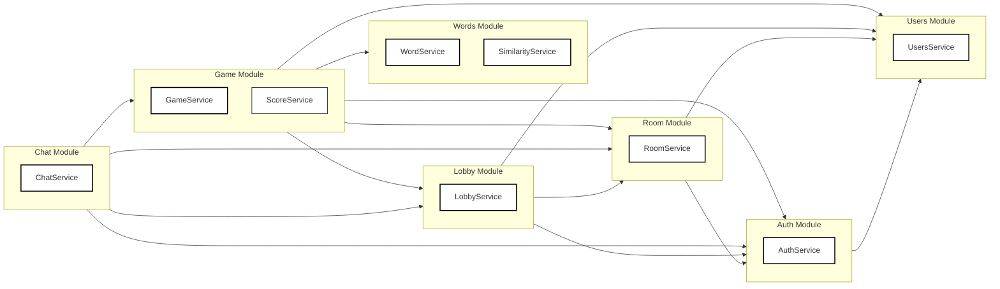

What to implement now
	1.	UsersModule: GET /users/me, PATCH /users/me (username).
	2.	WordsModule: seed service + SimilarityService + private draw(n) used by Game.
	3.	RoomModule: create/list/get/join/leave + team CRUD (waiting phase).
	4.	ChatModule: gateway + persistence + pagination + WS auth.
	5.	GameModule: start → rounds/turns/guess/skip/end; emit events.

If you want, I can stub each controller/service next with minimal DTOs so your team can parallelize (one person per module) without stepping on each other’s toes.